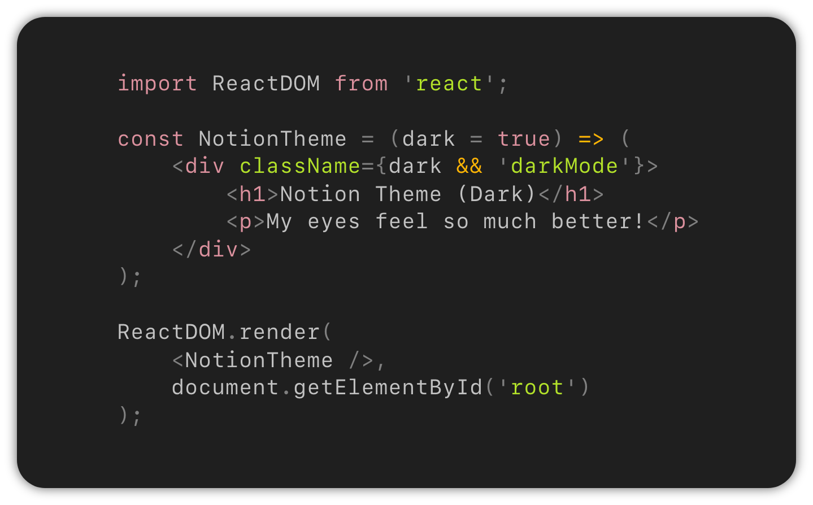

    

---

    VSCode theme based on <a href="https://www.notion.so/">Notion</a>'s code block.

---

  

> Code snippet shows the _Notion Code Block (Dark)_ theme with  [_SF Mono_](https://developer.apple.com/fonts/) font.

## Installation

1. Open the **Extensions** tab in the sidebar in VS Code or press `Ctrl+Shift+X` (`Cmd+Shift+X`)
2. Enter `Notion Code Block (Dark)` in the search bar
3. Click on the extensions and press **Install**
4. Open the **Command Palette** with `Ctrl+Shift+P` (`Cmd+Shift+P`)
5. Select **Preferences: Color Theme** and choose `Notion Code Block (Dark)`.
